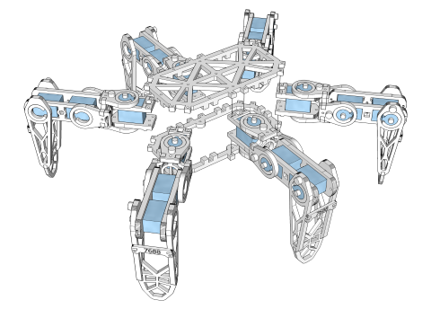
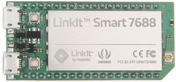
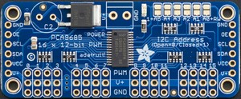
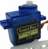
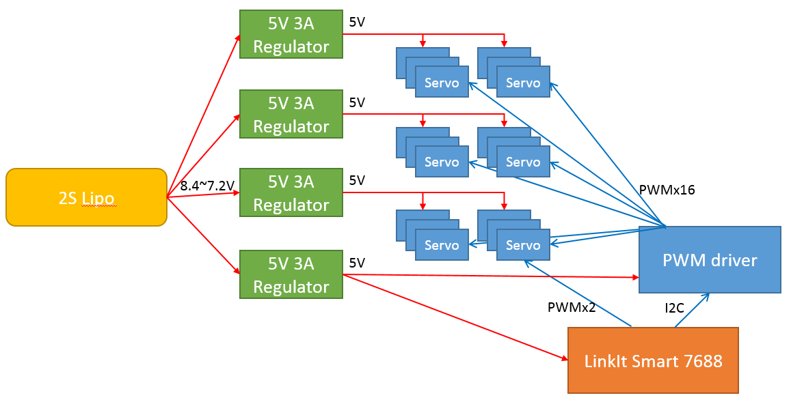

# An 18 DOF Hexapod project using LinkIt Smart 7688 + PCA9685


[Youtube video](https://www.youtube.com/watch?v=CbFrT2eCAvw)

## Hardware

* Body: 3D printed, go to [STL](STL) folder 
* [LinkIt Smart 7688](labs.mediatek.com/7688) 
* [Adafruit 16-channel PWM driver (PCA9685)](https://www.adafruit.com/product/815) 
* SG-90 mini servo x 18 
* DC/DC Buck Voltage regulator (Mini 360 from Taobao/[Amazon](http://www.amazon.com/4-75-23V-1-17V-DC-DC-Converter-Module/dp/B00NJCAI7G)) 
* 2-cell LiPo battery

### Electronics



There are 18 servo controlled by 18 PWM channel, 2 of them are from 7688 itself (GPIO18 & GPIO19), the rest are from the PWM driver connected to 7688 via I2C interface

And 4 DC/DC buck voltage regulator are used because servo draw lots of amount of current (500mA each, 9A total). Each of them provide *3A* current and serve 6 servos (2 legs)
Voltage regulator 1~3 serves all 18 servos
Voltage regulator 4 serves 7688 and PCA9685 (PWM driver IC)

## Software

### hexapod.js

The files contains:
* Logic to control 18 servo via I2C or PWM0/1 (check function `writePwm`)
* IK (inverse kinematics) algorithm (check function `loc2angle`)
* Movement path table (check function `_dance` and array `_danceTable1`)
  * There are 3 path now:
    1. forward/backward waving ([youtube video](https://youtu.be/CbFrT2eCAvw?t=37))
    2. left/right waving ([youtube video](https://youtu.be/CbFrT2eCAvw?t=2))
    3. circle waving ([youtube video](https://youtu.be/CbFrT2eCAvw?t=11))
  * The path are pre-generated by anohter JS, described later
* The main loop (check function `_next`)

### How 7688 control Adafruit PWM driver (PCA9685) via MRAA

First, create an I2C object 
```
var mraa = require("mraa")
var pwms = new mraa.I2c(0)
```

Second, setup I2C address (the default is 0x40, check adafruit's [page](https://learn.adafruit.com/16-channel-pwm-servo-driver/chaining-drivers) for how to set a different address)
```
pwms.address(0x40)
```

Setup PRE_SCALE so that PWM frequency is 61Hz, the period will be 16.37ms, PCA9685 is 12-bit precesion PWM, it has 4096 unit, So it will be `4us` per unit (16.37 / 4096)
According to datasheet, "Writes to PRE_SCALE register are blocked when SLEEP bit is logic 0 (MODE 1)", so a modify/restore MODE0 is required before/after modify PRE_SCALE.
```
pwms.writeReg(0, 0x10)   // SLEEP bit = 1
pwms.writeReg(0xFE, 110) // 61Hz, 16.37ms, ~4us per unit
pwms.writeReg(0, 0x0)    // SLEEP bit = 0
```

According to datasheet, the first 2 registers of each pin are LED_ON, and the other 2 registers are LED_OFF. 
But I found out writing to LED_ON does NOT work. Instead it is inversed, only writing to last 2 register (LED_OFF) works. 
Normal servo operates from 1000us to 2000us: 1500us correspond to center position and 1000/2000us correspond to both end.
The value should be divided by 4 because each unit is 4us. 
```
value = value / 4        // us to unit
pwms.writeReg(6+pin*4, 0);
pwms.writeReg(7+pin*4, 0);
pwms.writeReg(8+pin*4, value & 0xFF);
pwms.writeReg(9+pin*4, (value>>8) & 0xFF);
```
